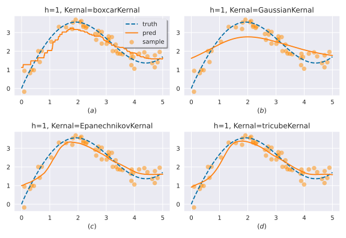
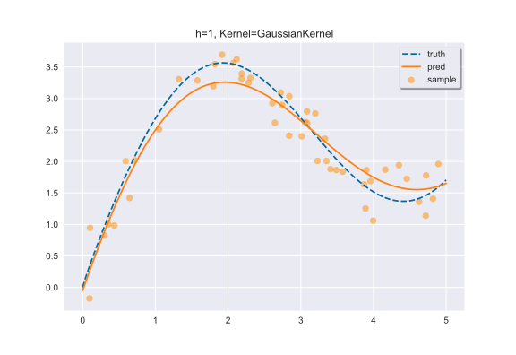
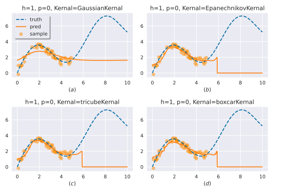
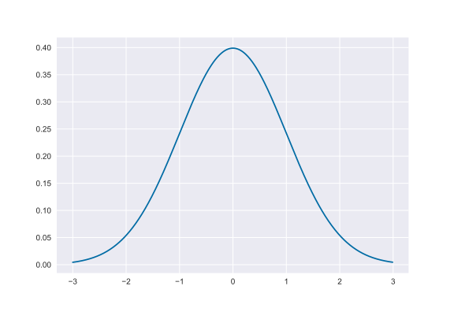

<h1 align="center">🧰NopaPy: NonParametric Statistic🧰 </h1>

<div align="center">

English | [简体中文](./README.zh.md)
</div>

## 🚀Download
`
pip install nopapy
`

## 🎉Quick Start
```
import numpy as np
import nopapy as npp

x = np.array([1, 2, 3, 4, 5])
y = np.array([2, 4, 6, 8, 10])
ypred = npp.NWEstimate(x, y, 3.5) # supposed to be 7
print(ypred) # 6.910633194984344
```

## 📕What Else Can You Do
You can experiment with various nonparametric methods...
<div align="center">
    
</div>


## 🎨Other Modules
- Kernel: Supports multiple built-in kernel functions and allows customization of kernel functions.
- Estimate: Includes various non-parametric estimation methods, allowing customization of kernel functions, smooth bandwidth, and order.
- Regression: Provides multiple smoothing methods for batch prediction.
- Scikit_like: Supports the generation of regression objects with specific parameters like scikit-learn and PyTorch.

## 🎰 Case: Estimate & Regression
## Case 1: Estimate
First, you need to import some necessary libraries, including numpy and nopapy. Here, we only need GaussianKernel and LPEstimate. If you also want to plot, you need to import matplotlib.

To reproduce the results of this case, we recommend setting the seed and the style of matplotlib.

```python
import numpy as np
from nopapy import GaussianKernel, LPEstimate
import matplotlib.pyplot as plt

np.random.seed(0)
plt.style.use('seaborn') # do not delete this, plz:)
plt.style.use('tableau-colorblind10')
```

The second step is to construct a function:
$$f(x) = 2 \sin(x) + x^{0.8}$$
Assuming that our sample comes from this function, the range of the independent variable is $[0, 5]$, and the dependent variable is the value of $f(x)$ plus random noise. xs0 represents the target point that we want to fit with non-parametric regression methods.
```python
def f(x):
    return 2 * np.sin(x) + x ** 0.8

sample_number = 50
x = np.sort(np.random.rand(sample_number) * 5)
y = f(x) + np.random.normal(loc=0, scale=0.3, size=(sample_number,))
xs0 = np.arange(0, 5.01, 0.01)
```
Now we can start fitting. Here, we use GaussianKernel and LPEstimate, and set the order of LPEstimate to 2. In fact, you can freely choose the kernel function and regression method. The only difference is that other regression methods do not need the parameter p.
```python
kernel = GaussianKernel; h = 1; method = LPEstimate; p = 2
y_pred = [method(x, y, x0, h, k=kernel, p=p) for x0 in xs0]
```
The final step is to plot the result. The plotted result includes the sample points $(x, y)$, the function $f(x)$, and our regression function $g(x)$.
```python
plt.scatter(x, y, alpha=0.5, label='sample', c='darkorange')
plt.plot(xs0, f(xs0), '--', label='truth')
plt.plot(xs0, y_pred, label='pred')
plt.title('h={}, Kernel={}'.format(h, kernel.__name__))
plt.legend(loc='best', frameon=True, framealpha=1, shadow=True)
plt.show()
# plt.savefig('./LPR.svg', dpi=2000)
```
The plotted result should look like the following figure. You can adjust the bandwidth, change the kernel function, change the regression method, and even set the order to observe the differences in fitting effect.

<div align="center">
    
</div>

Additionally, in the above example, we passed all possible parameters, but many of them have default values. The only required parameters that need to be passed are x, y, and x0.
For instance:
`
y_pred = [method(x, y, x0) for x0 in xs0]
`
. The Regression method we are going to introduce next has the same property. You can omit unnecessary parameters just like in the previous example.
## Case 2: Regression
The other steps are almost the same, but the Regression method is more powerful in that it can predict a series of target points simultaneously.
```python
import numpy as np
from nopapy import GaussianKernel, LPRegression
import matplotlib.pyplot as plt

np.random.seed(0)
plt.style.use('seaborn') # do not delete this, plz:)
plt.style.use('tableau-colorblind10')

def f(x):
    return 2 * np.sin(x) + x ** 0.8

sample_number = 50
x = np.sort(np.random.rand(sample_number) * 5)
y = f(x) + np.random.normal(loc=0, scale=0.3, size=(sample_number,))
xs0 = np.arange(0, 5.01, 0.01)

kernel = GaussianKernel; h = 1; method = LPRegression; p = 2
y_pred = LPRegression(x, y, xs0, h, k=kernel, p=p)

plt.scatter(x, y, alpha=0.5, label='sample', c='darkorange')
plt.plot(xs0, f(xs0), '--', label='truth')
plt.plot(xs0, y_pred, label='pred')
plt.title('h={}, Kernel={}'.format(h, kernel.__name__))
plt.legend(loc='best', frameon=True, framealpha=1, shadow=True)
plt.show()
# plt.savefig('./LPR.svg', dpi=2000)
```

### ⚠️WARNING
You can also use Regression just like using Estimate to predict a single point, which won't cause any correctness issues in the code.
However, we strongly discourage this approach as it may lead to some performance issues.
If you have to do this, you will receive a warning:
```
UserWarning: LPRegression() expects xs0 to be np.ndarray or list.
Your code won't make any errors, but we still recommend that you use LPEstimate() instead.
warnings.warn(warn_msg) 
```

### ⛔  Don't do this...
You may want to use non-parametric regression for extrapolation prediction, but this is not a typical application scenario of non-parametric regression.
Our code does not prohibit this behavior, because we are not sure if you really want to do this, for example:

<div align="center">
    
</div>

It can be seen that except for GaussianKernel, all other regression methods are invalid because they indirectly use the indicator function $I(x)$.
The prediction results of GaussianKernel are also unsatisfactory because non-parametric regression uses "smoothing methods", which are only valid for values in the domain $[min(x), max(x)]$.
## 🎰Case: Kernel & Custom
## Case 1: Kernel
We provide multiple built-in kernel functions that can be directly used in the corresponding estimation and regression methods. They can also be used separately, which may be helpful for your research.
You can use the code
npp.kernel.kernel.__all__
to view all kernel functions. Their usage is relatively flexible, and you can freely choose, for example, passing a scalar or an array to it.
```python
from nopapy import GaussianKernel
x = np.arange(-3, 3, 0.01)
y = GaussianKernel(x)
plt.plot(x, y)
plt.show()
```
<div align="center">
    
</div>


## Case 2: Custom

At the same time, we also support you to customize kernel functions. Kernel functions are a type of functions with special mathematical properties. Generally, they need to satisfy the following properties:

- Non-negativity: $f(x) \geq 0$
- Symmetry: $E(x) =\int xK(x) dx=0$
- Probability density: $\int K(x) dx=1$
- Positive variance: $D(x)=E(x^2)=\int x^2K(x) dx>0$

The kernel function $custom_kernel(x)$ you implement needs to satisfy the above properties. Generally speaking, you can search for the kernel functions you are interested in through search engines and implement them as Python functions.
We provide the function $I(x)$ to help you quickly implement your kernel function. Many kernel functions rely on the indicator function. For example:
```python
def EpanechnikovKernel(x):
    return EPANECHNIKOV_COEFFICIENT * (1 - np.power(x, 2)) * I(x)
```
PS: GaussianKernel is an exception, it has elegant mathematical properties.

### 👉 Is my function correct?

We also provide the function $is_kernel$ to check whether your kernel function is correct. It takes a function as input and outputs a boolean value as a flag for correctness.
```python
ret = is_kernel(GaussianKernel)
print(ret) # True
```