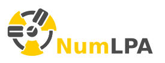

# NumLPA



What does it mean?

> The name "NumLPA" comes from the contraction of "Numerical Line Profile Analysis".

What is the use of it?

> NumLPA is a Python package developed for research in materials science.

Is it hard to use?

> Just type one of the available commands in a terminal and look at the generated files.

## Background

The physical properties of a solid material are strongly impacted by the nature and quantity of structural defects it contains.
It is therefore important to have reliable tools to characterize deviations from a perfect crystal.
Line Profile Analysis (LPA) is one of the methods used for the study of microstructures from the analysis of X-ray diffraction patterns.

## Features

NumLPA Has been developed to meet the need to analyze the accuracy of LPA models.
The main features of the package are presented bellow:

* `draw`: Generate samples of dislocations by random drawing from different probability distribution models.
* `analyze`:
* `diffract`: Simulate X-ray diffraction on crystals containing the previously generated dislocations and compute the Fourier transform of the diffracted intensity.
* `merge`: Average the Fourier transform coefficients from multiples samples drawn from a same distribution.
* `fit`: Fit theoretical models on the simulated diffraction profiles to obtain their predictions and compare them to the real parameters of the distribution.
* `export`: Export figures illustrating the previously generated data according to different representations.

## Installation

### Virtual environment

It is generally advisable to install Python packages in [virtual environments](https://docs.python.org/3/library/venv.html).
This is not necessary, but it will allow you to isolate the package and its dependencies from the rest of your computer.

### PyPi

Stemplate is available on the [Python Package Index](https://pypi.org/project/numlpa).
The easiest way to install it is to run the following command:

```bash
pip install numlpa
```

### Development mode

If you want to work on the package source files, you can install the package in [development mode](https://packaging.python.org/en/latest/guides/distributing-packages-using-setuptools/#working-in-development-mode).
To do this on a POSIX system, clone, or download the project from its [GitLab repository](https://gitlab.com/x-rays/numlpa) and execute the following command in it:

```bash
source setup.sh
```

This will automatically install a virtual environment containing all the necessary dependencies for the development and operation of the package.
For more information, see the shell script [`setup.sh`](/setup.sh).

## Usage

### Units

### Generate a sample of dislocations

### Compute the Fourier transform

### Adjust the model

### Illustrate

### Evaluate energy

## Credits

* Dunstan Becht
* Asdin Aoufi
* András Borbély

## License

This program is free software: you can redistribute it and/or modify it under the terms of the GNU General Public License as published by the Free Software Foundation, either version 3 of the License, or (at your option) any later version.

This program is distributed in the hope that it will be useful, but WITHOUT ANY WARRANTY; without even the implied warranty of MERCHANTABILITY or FITNESS FOR A PARTICULAR PURPOSE. See the GNU General Public License for more details.

You should have received a copy of the GNU General Public License along with this program. If not, see <https://www.gnu.org/licenses/>.
